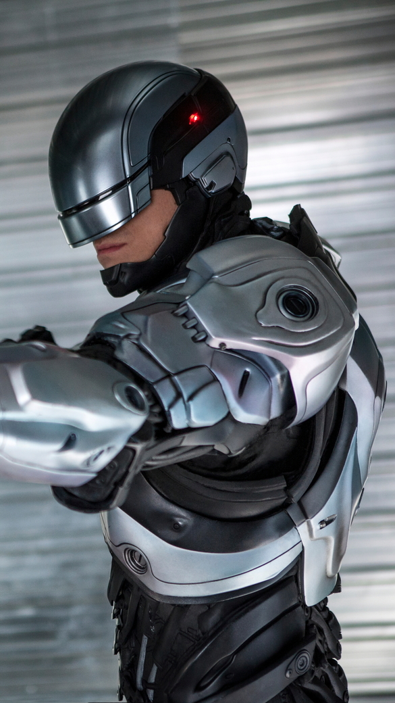
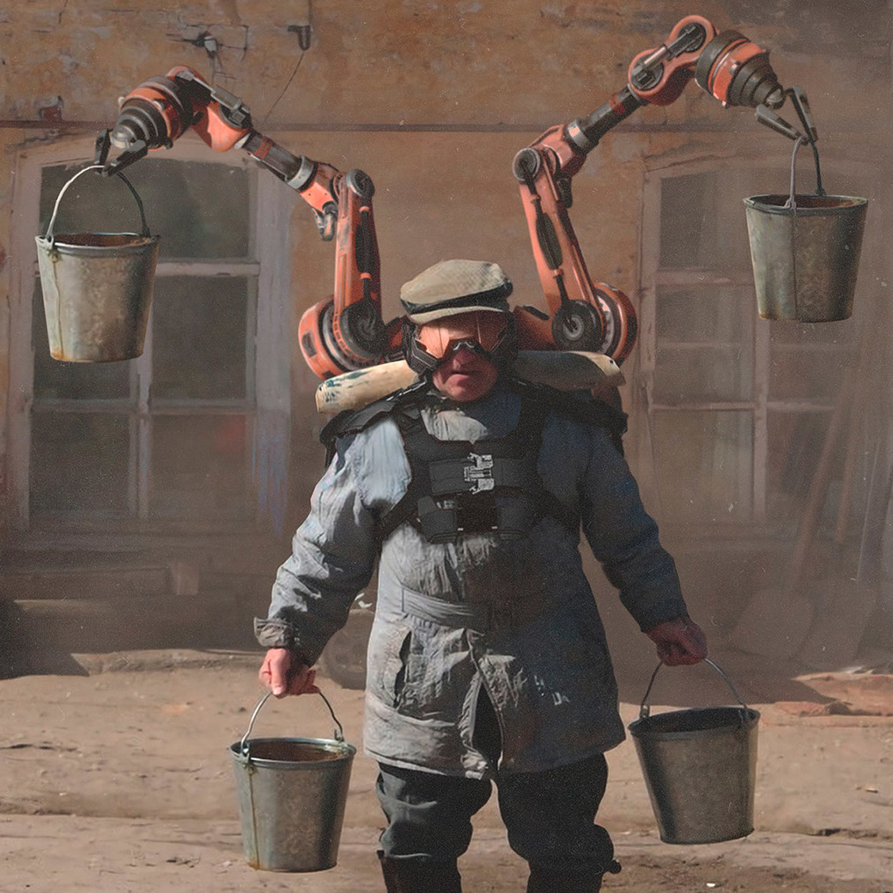

# !! Приветствие

# !! Что это такое

> это интеграция каких-то автоматизированных вещей, не биологических, в биологическую структуру человек

> это замена имплантом любого органа человеческого тела, например, если этот орган не может уже функционировать.

> Прям киборг такой. Весь в железках. Робот. И за ним много компьютеров и хакеров.

> это когда люди расширяют свои
возможности за счёт каких-либо имплантантов или
возвращают утраченные способности с помощью
киберпротезов, например, механического запястья

# !! Отношение людей к кибернетизации / pros-cons

## За

> Если это улучшит жизнь людей и они будут к этому готовы, то
почему нет

> везде есть те, кто против трендов, а кибернетизация будет таковой

> всегда найдутся противники кибернетизирования, хоть и их 
  количество явно будет незначительно в сложившихся условиях.
    

## Против

> Человек должен оставаться человеком, а не мутантом или
роботом. Зачем это все? Кто оценивает последствия всех таких
вмешательств? Таким макаром действительно может настать
глобальная катастрофа, как в кино, все эти роботы нападают
на человечество и господствуют во всем мире

# !! Для чего будут использовать / usage

> В первую очередь это будет очень востребовано у инвалидов, у
людей с ограниченными возможностями здоровья, в частности
конечности (руки, ноги) для того, чтобы облегчить жизнь
человека

> Быстрые ноги, сильные руки, острое зрение. Что еще нужно
человеку для счастья?

> Я бы сделала упор на сердце, наверное. И другие внутренние
органы, которые обеспечили бы, аля “вечную жизнь”

> Я думаю, что будет идти упор на внедрение кибернетизации в
военную сферу

> в первую очередь будет использоваться в медицинских целях. Но также, скорее
всего, если это будет не сложно и безболезненно, то это станет неким дополнением,
предметом роскоши среди богатых людей.

# !! Война

# !! Есть ли граница / limits

> Не вижу смысла в ограничениях

> может 98%, потому что 2 процента тела это мозг.

> Если мозг заменять по клеточно, то в какой момент он перестанет быть мозгом?

# !! Спорт / sport

> Думаю, будет отдельная команда из киборгов, выступающая под
флагом своей страны

> Я сейчас подумала, что такие боксерские поединки были бы очень
и очень зрелищными

> Прямо вижу, как перед началом соревнования
человека проверяют на наличие ПО в… мозгах?

> Скорее всего это будут соревнования не между людьми; а между компаниями, которые делают эти киберимпланты 
и представляют свою страну

> Будут соревнования между различными компаниями, занимающимися
кибернетизацией человеческого тела, какие-то соревнования, которые будут проверять и
сравнивать возможности продуктов этих компаний.

> спорт для кибернетизированных людей, со своими дополнительными правилами, рекордами
и дисциплинами.

# !! Мода / fashion

> Люди сейчас меняют отношение из-за твоего телефона. Это
думаю будет что-то схожее. Рука, которая может прожить без
подзарядки месяц, выгибается во все стороны и может сделать
тебе кофе – это последний айфон, а рука, установленная Арсеном
в подвале, которая может тебе сделать шаурму и после этого
разрядится – айфон 5S

> Мода сыграет огромную роль. Большинству людей не будет
необходимо улучшение тела. Общественное мнение окажет
большое влияние. Появятся объединения таких людей, своя
культура, к которой многие захотят приобщиться

> Наверное, все тело будет модно кибернетизировать, чем больше у тебя кибернетических частей тела, тем ты круче.

# !! Регионы развития

> Я считаю, что американцы, японцы, южные корейцы, может
быть германцы лучше всего продвинутся в этой сфере, потому
что у них есть и финансирование, и почва для проведения таких
работ

# !! В рф / russia

> В последнее время в социальных сетях я видел забавные
иллюстрации типа кибер-панк в России. Нет, если серьезно, это
сложно представить, я думаю, что в России Это будет так же
как и в других странах: дорогие импланты будут ставится
людям, которые могут за это заплатить. Разумеется, таких
людей не так много

> Ну Россия — это Россия… Здесь мы разве что увидим бабу с кибернетизированным ведром

> будут говорить, что это бездуховно и будут приводить в аргументы религию и прочее

# что может пойти плохо

> Человек станет роботом, потеряет свою человечность и станет запрограммированной
машиной.

> Возможно, психически больных  людей станет больше. ... Из-за ощущения безграничных возможноетсей.
# Профессии
> Доктора, конкретно хирурги. Тонкая работа требует стабилизации рук.
 
> Шахтёры, работники нефтепромысла.

